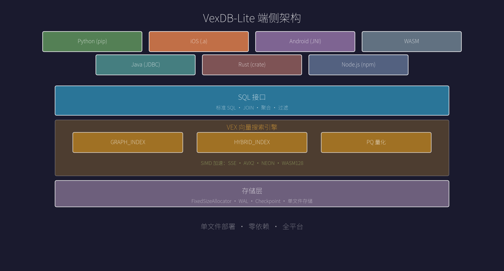
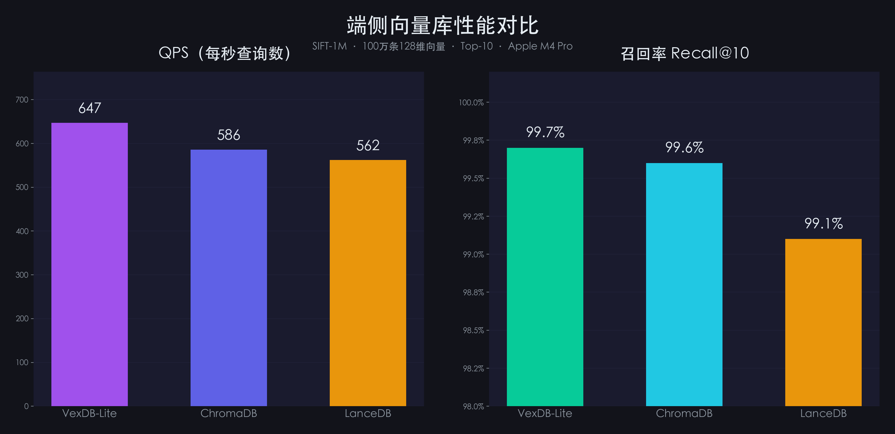
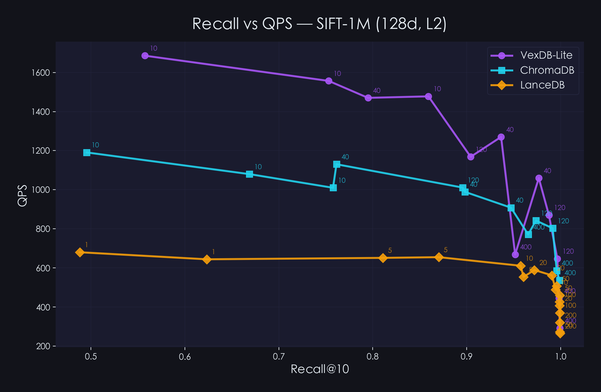

<div align="center">
  <h1>VexDB-Lite</h1>
  <p><strong>嵌入式向量搜索引擎，一个文件就是一个数据库</strong></p>
  <p>不需要服务器，不需要网络，数据不出设备。</p>
  <p><a href="README.md">English</a> | <a href="README_zh.md">中文</a></p>
</div>

---

<p align="center">
  
</p>

## VexDB-Lite 是什么

VexDB-Lite 是一个嵌入式向量搜索引擎。你可以把它理解为：一个既能做传统关系查询，又天生懂"语义搜索"的嵌入式数据库。

传统数据库擅长精确匹配——你搜"苹果"，它只返回包含"苹果"的结果。但 VexDB-Lite 不同，它能理解"水果"和"苹果"之间的关系，因为它搜索的是向量，不是文本。同时，你依然可以用标准 SQL 做 JOIN、聚合、过滤——关系型的能力一样没少。

没有 Docker，没有集群，没有网络请求。一个文件，就是一个数据库。

```sql
-- 创建向量索引
CREATE INDEX idx ON documents USING GRAPH_INDEX(embedding)
  WITH (metric='cosine', m=16, ef_construction=200);

-- 语义搜索，一条 SQL 搞定
SELECT title, content
FROM documents
ORDER BY cosine_distance(embedding, [0.1, 0.2, ...])
LIMIT 10;
```

---

## 一个库，全平台通吃

VexDB-Lite 不只是一个 Python 包。它是一个编译好的原生引擎，直接跑在 iOS、Android 和浏览器上：

| 平台 | 集成方式 | 包体积 |
|------|---------|--------|
| Python（桌面/服务器） | `pip install vexdb-lite` | — |
| Java | `vexdb-lite.jar` (JDBC) | 32 MB |
| iOS | `libvexdb.a` 静态库 | **11 MB** |
| Android | `libvexdb.a` + JNI | **11 MB** |
| 浏览器 | WebAssembly 模块 | **~8 MB** |
| Rust | `vexdb-lite` crate | — |
| Node.js | `vexdb-lite` npm 包 | — |

11 MB 包含了完整的 SQL 引擎 + 向量索引 + PQ 量化。不需要加载扩展，开箱即用。

---

## 全平台 SIMD 加速

端侧设备千差万别，VexDB-Lite 对此做了充分适配：

- Intel/AMD 笔记本：SSE + AVX2 指令集加速
- Apple M 系列 / Android 设备：ARM NEON 加速
- 浏览器环境：WebAssembly SIMD128 加速

从笔记本到手机，从边缘设备到浏览器，向量距离计算都能跑在硬件加速通道上。

---

## 能做什么

**两种索引，覆盖主流场景**

- **GRAPH_INDEX** — 图索引，适合纯向量近邻搜索
- **HYBRID_INDEX** — 混合索引，支持向量 + 标量联合过滤

一条 SQL 就能同时做结构化过滤和语义搜索：

```sql
CREATE INDEX idx ON products USING HYBRID_INDEX(embedding, category);

SELECT name, price
FROM products
WHERE category = '数码'
ORDER BY cosine_distance(embedding, [0.1, 0.2, ...])
LIMIT 10;
```

**三种距离度量** — L2 欧氏距离、Cosine 余弦相似度（自动归一化）、Inner Product 内积

**PQ 量化压缩** — 一行配置，向量体积压缩 4-8 倍：

```sql
CREATE INDEX idx ON docs USING GRAPH_INDEX(embedding)
  WITH (quantizer='pq', pq_m=8);
```

**向量去重** — 相同向量只建一个图节点，索引更小，检索更快

**并行索引构建** — 多线程加速，`WITH (threads=8)` 一行搞定

**单文件持久化** — 数据 + 索引一个 `.db` 文件，重启后自动恢复

---

## 适用场景

**本地知识库助手**。在笔记本上跑一个 RAG 应用，文档 Embedding 存在 VexDB-Lite 里，配合本地 LLM，完全离线的智能问答。

**移动端语义搜索**。相册按语义搜图、聊天记录智能检索、本地推荐系统——不依赖网络，体验更快，隐私更好。

**IoT 与边缘计算**。工业设备的异常检测、传感器数据的模式匹配，在边缘节点就地完成，不用回传云端。

**企业私有化部署**。对数据安全要求高的企业，VexDB-Lite 可以部署在内网机器上，没有外部依赖，审计和合规更简单。

---

## 性能

<p align="center">
  
</p>

**SIFT-1M 基准测试**（100 万 × 128 维，Apple M4 Pro，Recall ≥ 98.5%）

| 指标 | VexDB-Lite | ChromaDB | LanceDB |
|------|-----------|----------|---------|
| 数据导入 | 0.9 秒 | 509 秒 | 0.5 秒 |
| Recall@10 | 99.7% | 99.6% | 99.1% |
| QPS | 647 | 586 | 562 |
| 平均延迟 | 1.5 ms | 1.7 ms | 1.8 ms |

<p align="center">
  
</p>

VexDB-Lite 在 Recall-QPS 曲线上始终占据右上角——同等召回率下吞吐最高。

---

## 测试

**9 个平台，259 test cases，6302 assertions，全部通过。**

| 平台 | 用例 | 断言 |
|------|:---:|:---:|
| Desktop（SQL 全量） | 82 | 3446 |
| Python（SQL 全量） | 83 | 2394 |
| iOS 模拟器 | 16 | 108 |
| Android 模拟器 | 16 | 108 |
| WASM | 8 | 8 |
| Java JDBC | 13 | 13 |
| Rust | 9 | 9 |

---

## 文档

| 平台 | 使用指南 |
|------|---------|
| CLI | [usage_cli.md](vexdb-duck/docs/usage_cli.md) |
| Python | [usage_python.md](vexdb-duck/docs/usage_python.md) |
| Java | [usage_java.md](vexdb-duck/docs/usage_java.md) |
| iOS | [usage_ios.md](vexdb-duck/docs/usage_ios.md) |
| Android | [usage_android.md](vexdb-duck/docs/usage_android.md) |
| WASM | [usage_wasm.md](vexdb-duck/docs/usage_wasm.md) |
| Rust | [usage_rust.md](vexdb-duck/docs/usage_rust.md) |
| Node.js | [usage_nodejs.md](vexdb-duck/docs/usage_nodejs.md) |

---

## 构建

```bash
# 1) 指向一个独立的 DuckDB 源码目录
export DUCKDB_SOURCE_DIR=/path/to/duckdb

# 2)（可选）指定与运行时 DuckDB 匹配的版本标签
# export DUCKDB_VERSION_TAG=v1.4.4

# 3) 构建可加载的 vex 扩展
./build.sh all Release

# 4) 产物示例
# build/standalone/_duckdb/extension/vex/vex.duckdb_extension
```

在 DuckDB 中加载：

```sql
LOAD '/absolute/path/to/vex.duckdb_extension';
SELECT vex_version();
```

---

## License

MIT

VexDB-Lite 基于 [DuckDB](https://duckdb.org/)（MIT License）构建。
